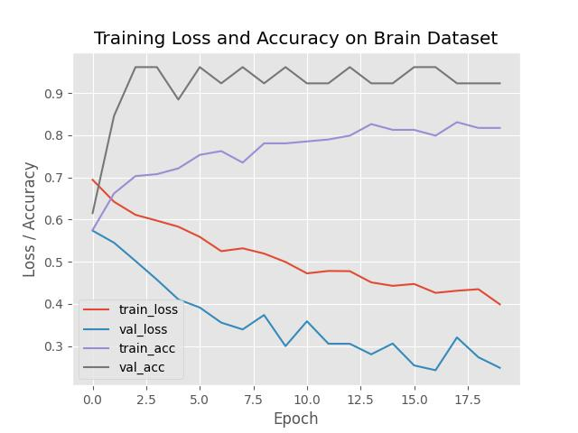
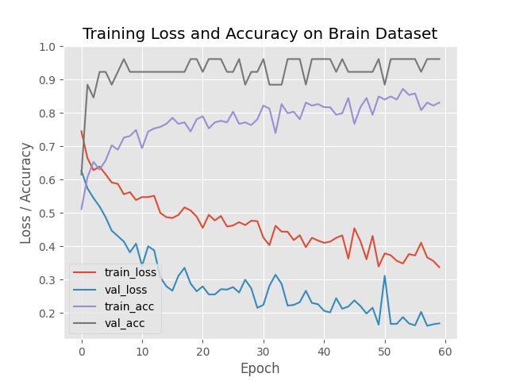
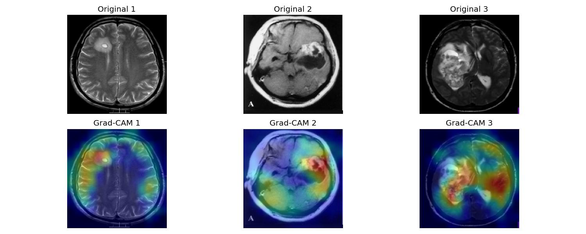
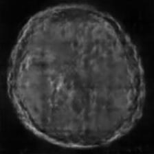
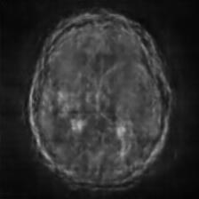
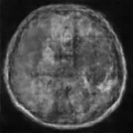
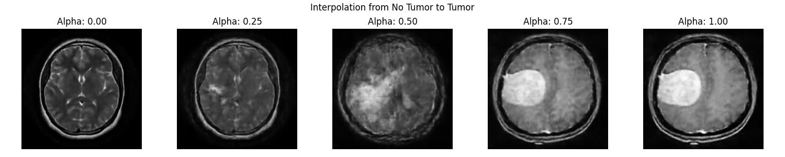
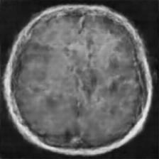
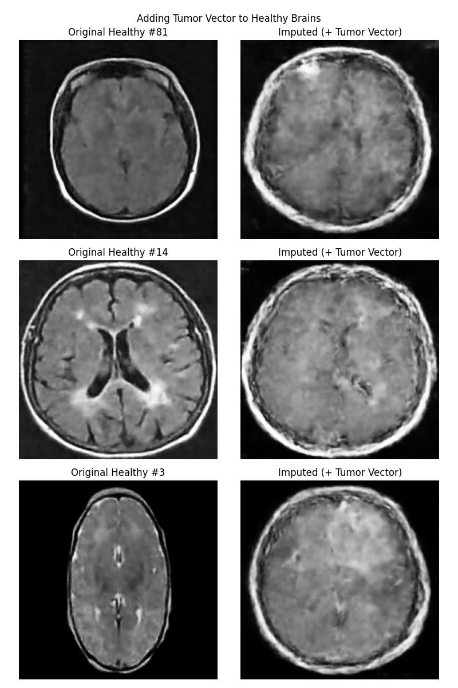
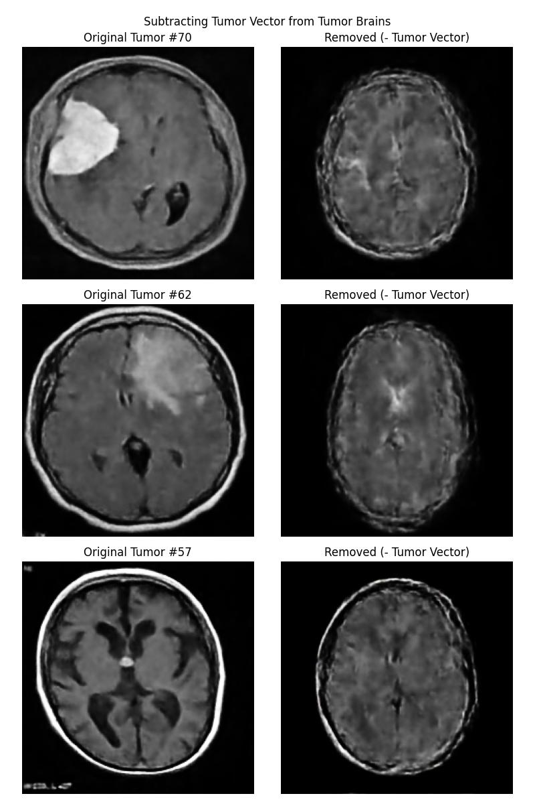

# Brain Tumor Detection & Latent Space Exploration

本專案是一個機器學習的學習專案，主要紀錄了從基礎的影像分類到生成模型的潛在空間（Latent Space）探索過程與心得。

## 1. CNN Binary Classifier 與模型搭建

在這個階段，我學習了如何使用 Keras 像接水管一樣，一層一層地搭建卷積神經網路（CNN）模型。我們建立了一個 Binary Classifier 來分辨大腦影像中是否含有腫瘤（Tumor vs. No Tumor），並處理了資料的載入、增強（Data Augmentation）與切分等前處理流程。

## 2. Grad-CAM 模型注意力觀察

為了確認我們的 CNN 模型是真的學到了腫瘤的特徵，而不是因為圖片的其他無關背景（如邊界、浮水印）而做出判斷，我們實作了 **Grad-CAM (Gradient-weighted Class Activation Mapping)** 技術。

透過 Grad-CAM 生成的熱力圖（Saliency Map），我們可以清楚看到模型在進行「有腫瘤」的判斷時，注意力確實集中在腫瘤發生的位置上。

## 3. Auto Encoder 與 KL Divergence 實驗

接下來，本專案實作了變分自編碼器（Variational Autoencoder, VAE），並加入 **KL Divergence** 作為損失函數的一環。KL Divergence 能幫助我們把 Latent Space 高維度空間梳理得更平滑且具有結構性，讓生成的特徵可以被分開。

在訓練好 Encoder 與 Decoder 之後，我們在 Decoder 後方接上訓練好的 Classifier（分類器）。透過**梯度上升（Gradient Ascent）**的方法，我們從一組隨機常態分佈的高維向量開始，找出能讓 Classifier 判定「這是腫瘤的機率最高」的 Latent Vector（潛在向量 `loss_z`），接著再把這個推擠到極限的向量丟回 Decoder 產生圖片，藉此觀察模型心目中「最純粹的腫瘤特徵」長什麼樣子：

## 4. Latent Walk 與潛在空間特徵探索

最後，專案中進行了 **Latent Walk** 實驗。藉由在 Latent Space 中將「無腫瘤」的向量逐漸線性插值推移到「有腫瘤」的向量，我們能觀察到 Decoder 生成的圖片如何平滑地展現腫瘤「從無到有」的漸進變化過程。若成功則能證明了我們的 VAE 成功地在 Latent Space 中把正常的腦部特徵與腫瘤特徵分開，並學習到了它們的潛在分佈。

健康大腦的平均向量

有腫瘤大腦的平均向量

從健康到有腫瘤的 Latent Walk

腫瘤向量 = 平均腫瘤大腦向量 - 平均健康大腦向量

健康大腦向量 + 腫瘤向量

腫瘤大腦向量 - 腫瘤向量

可見實驗並不成功，仔細看他的表現並不好，健康圖加上腫瘤後只是變圓變亮和變糊，腫瘤圖減去腫瘤變得瘦和暗，同時也變糊。  

這代表 VAE 的 Latent Space 並沒有成功地把正常的腦部特徵與腫瘤特徵分開。猜測可能是由於以下幾點：
1. 離散性：VAE 的 Latent Space 是一個連續的空間，而腫瘤的訓練資料只有有大種瘤與沒腫瘤兩種，這導致 VAE 無法將它們分開。
2. 空間平均問題：訓練資料裡的腫瘤長在腦袋各個位置，導致 腫瘤向量或許是對這些位置的平均，而不是純粹的腫瘤特徵。
3. 型態：腫瘤大腦偏圓，健康大腦偏橢圓。由於訓練集中「有腫瘤」的樣本可能在平均幾何形狀上較圓（如你所觀察到的型態差異），模型錯誤地將「幾何形狀的改變」編碼進了腫瘤向量中，而非將其視為個體差異。

VAE 的模型結構可能不適合用來學習腫瘤的特徵，需要再做調整。
